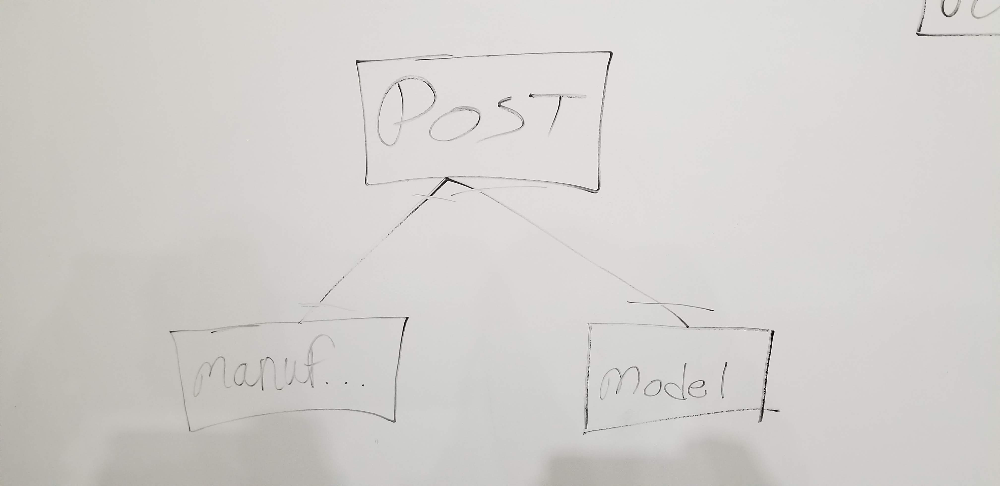
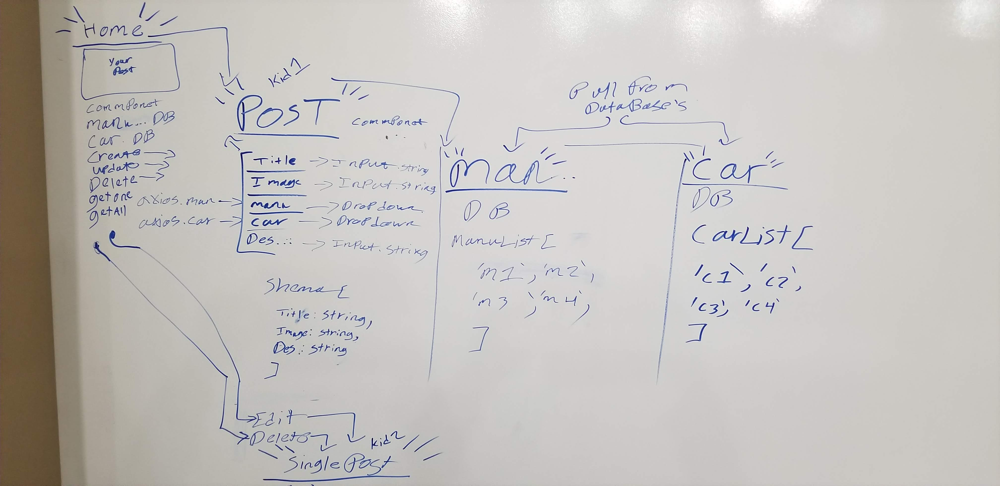

# Project 3
## Rush

- [GitHub](https://git.generalassemb.ly/IanGtHbE1/Project-3-Rush.git)
- [Trello](https://trello.com/b/wHalkJrN/project-3)
- [Heroku](https://rush-project-3.herokuapp.com/)

# WireFrame

# Over View
### Home Page
  - Holds the post the user creates
  - The user can create a post
  - Data base 1 holds manufacturer and Data base 2 holds model of the vehicle

### Post 
  - Holds a single post that was clicked on
  - The user can update or delete the post

### Creating a Post page
  - The user can use two data bases in creating a post
  - The user can add these fields to a post:
    - Title
    - image
    - description
    - manufacturer
    - model

<!-- # mern-template-project

# Setup A New Project From This Template

If you are starting a new project do the following:

1. copy/download this directory to where you new project is located and rename
   it to the name of your project.
1. change your directory (`cd`) into the copied project template
1. `npm install`
1. `npm run dev`
1. Open a new browser window and navigate to the URL http://localhost:3000/
    here you should see `hello world` displayed after page load
    updates should show up here automatically
1. see the `client/src` `readme.md` file for more information on the react project

# Setup A New Project Without This Template

If you want to start a project without using this template directory do the
following:

1. `mkdir <project-name>`
1. `cd <project-name>`
1. `echo "# <project-name>" > readme.md`
1. `git init`
1. `git add readme.md `
1. `git commit -m "init repo with readme.md"`
1. `npm init`
1. `mkdir models views controllers`
1. `touch ./server.js` -->
